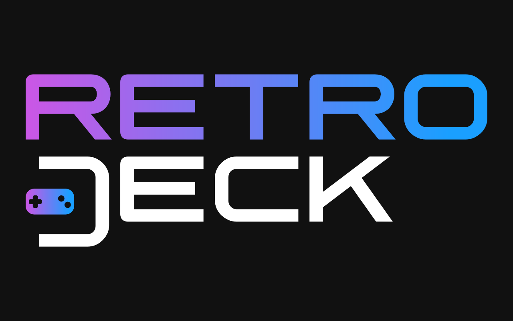

# Rolf



RetroDeck for WOLF, v0.1

## Why?
I want to be able to use WOLF like I am using MustardOS and similar on my handeld system.
## What is it?
This projects provides a RetroDeck docker [image](https://github.com/handtrixx/dolf/pkgs/container/retrodeck) to be used by the amazing Wolf project.

Using this you will get a you virtual PC with:
- A 486 DX2 CPU on 66 MHZ (tweakable)
- 16 MB of RAM (608KB EMS memory)
- A 2GB (!) HDD as C:
- MS-DOS 5
- S3 Trio Graphics Adapter
- CD-ROM Drive(s) + driver
- Mouse Driver
- Creative Labs Soundblaster 16 sound card at IRQ 7, DMA 5

So, an amazing gaming PC on the level of year 1993


## Quickstart

Dolf tries to make you start of MS-DOS in Wolf as easy as possible. 
If you are missing images of your games/applications, you either have to create image files from the 
installation discs you still have, or can maybe find them at a location like archive.org.

### 1. Edit Wolf Config file
```toml
[[apps]]
start_virtual_compositor = true
title = 'Dolf'
    [apps.runner]
    base_create_json = '''{
        "HostConfig": {
            "IpcMode": "host",
            "CapAdd": ["MKNOD"],
            "Privileged": false,
            "DeviceCgroupRules": ["c 13:* rmw", "c 244:* rmw"]
        }
    }
'''
    devices = []
    env = [ 'RUN_SWAY=true', 'GOW_REQUIRED_DEVICES=/dev/input/* /dev/dri/*' ]
    image = 'ghcr.io/handtrixx/dolf:latest'
    mounts = []
    name = 'Dolf'
    ports = []
    type = 'docker'
```

### 2. Start Moonlight
and play DOS Games